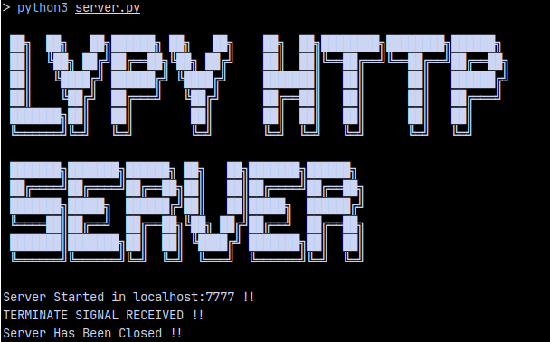

# lypy-http-server
## Descrtption
A Simple HTTP Server developed using Python
## Working
#### Starting the Server :
  * Open Terminal
  * Type ``` python3 server.py ```
#### Modifying Server Properties :
  * Edit ``` properties.py ``` file
  * Info about properties are provided in the file
#### Stopping the Server :
  * Press ``` Ctrl + C ```
## Screenshots

